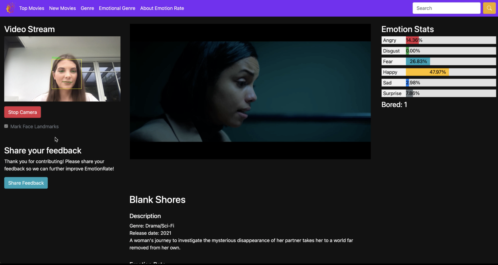

# EmotionRate: Enhancing Film Experiences through Emotion Recognition

## Project Overview
This project was developed as part of a Group Project during the **Affective Computing practical course at Ludwig Maximilian University of Munich (LMU) in the Summer Semester of 2024**. EmotionRate is a **web application** designed to enhance the emotional experience of watching films by integrating **facial emotion recognition and boredom analysis**. The application helps users select films based on their emotional impact, leveraging **affective computing** to align movie choices with user emotions.

## Features

- **Facial Emotion Recognition**: Real-time detection of six basic emotions.
- **Boredom Analysis**: Identifies signs of disengagement while watching films.
- **Interactive Film Rating System**: Provides insights into the emotional experience of movies.
- **Emotion-Based Film Recommendations**: Helps users choose films based on past emotional responses.
- **Study Integration**: Evaluates emotion recognition accuracy and user perception.

## Important Notes

- **MongoDB Credentials Required**: To run the application, users must enter valid MongoDB database credentials.
- **MP4 File Removal**: Originally, MP4 files were stored locally within the repository. However, due to copyright protections, these files have been removed. As a result, playback functionality will not work without additional media sources.

## Image Collection


## Tech Stack

### Frontend

- **HTML5**: Page structure.
- **CSS3**: Styling (layout, colors, fonts).
- **JavaScript**: Interactive elements.
- **Bootstrap**: Responsive UI components.

### Backend

- **Python**: Backend development.
- **Flask**: Web framework for handling requests.
- **Jinja2**: Template rendering engine.
- **OpenCV**: Computer vision for face detection.
- **TensorFlow/Keras**: Machine learning framework for emotion recognition.

### Data Storage

- **MongoDB**: Stores user emotion data and analysis results.

### Development Tools

- **virtualenv**: Isolated environment management.
- **pip**: Dependency installation.

## Important Files

- `app.py`: Main application script handling routes and interactions.
- `camera.py`: Captures real-time facial expressions for analysis.
- `button_toggle.py`: Controls UI elements for interactivity.
- `Expression_Recognition.ipynb`: Jupyter Notebook for training the emotion recognition model.
- `model.h5`: Pre-trained deep learning model for facial emotion recognition.

## Setup Instructions

### Prerequisites

- **Python 3.6+**
- **Virtualenv**
- **MongoDB credentials** (required for database access)

### Cloning the Repository

```bash
git clone <repository-link>
cd <repository-directory>
```

### Setting Up the Virtual Environment

1. **Create a virtual environment:**

```bash
python3 -m venv venv
```

2. **Activate the virtual environment:**

    - **Windows:**

   ```bash
   venv\Scripts\activate
   ```

    - **macOS/Linux:**

   ```bash
   source venv/bin/activate
   ```

3. **Install required packages:**

```bash
pip install -r requirements.txt
```

4. **Freeze dependencies (for development use only):**

```bash
pip freeze > requirements.txt
```

### Configuring the MongoDB Credentials
To enable full functionality, enter your **MongoDB credentials** in the application:

#### Modify `app.py` to include your database credentials:

```python
client = MongoClient("your-mongodb-connection-string")
```

## Running the Application

```bash
python app.py
```

## Research & Evaluation
The project was **evaluated through a study** to assess the accuracy of emotion recognition and user perception of the system. The findings indicate:
- **High accuracy in detecting certain emotions (up to 97% for fear, 92% for anger)**.
- **Lower accuracy for emotions like disgust (~18%) due to limited training data**.
- **User satisfaction with the concept and usability of EmotionRate**.

For a deeper understanding of our methodology, research questions, and results, please refer to the **full project report**.

## Team Members

| Member     | Current Position |
| ------ | ------ |
| Lea Sigethy     | LMU, M.Sc. Computer Science |
| Leonie Münster   | LMU, M.Sc. Media Informatics |
| Cristian Gavriliu    | LMU, M.Sc. HCI  |
| Tudor Teofanescu | LMU, M.Sc. Computer Science |

---

For further details, see the **full research paper** on EmotionRate and its development.

